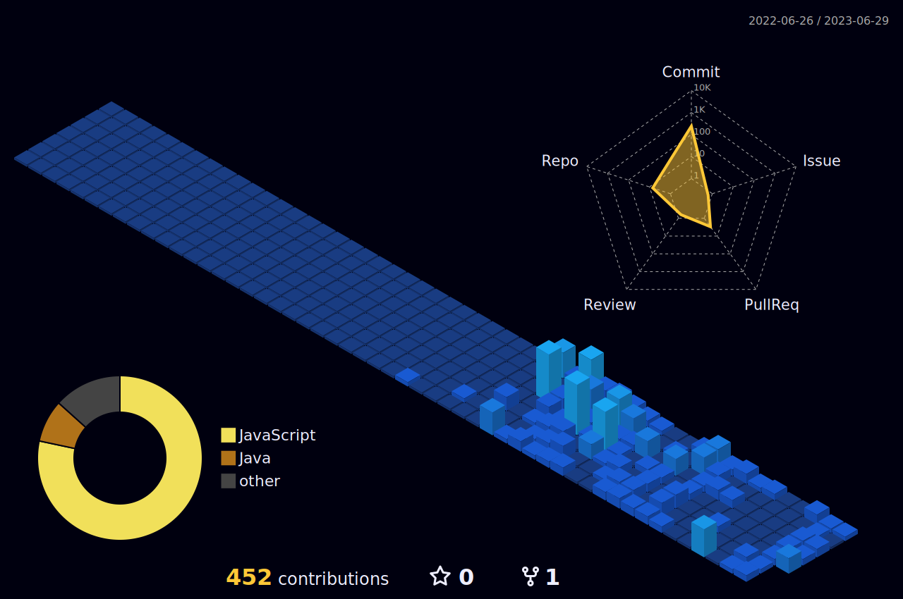

<h1 align="center">Hi 👋, I'm Kunj Faladu</h1>

  

- 🌱 I’m currently learning **MERN Stack**

- 👨‍💻 All of my projects are available at [coming soon.....]

- 📫 How to reach me **kunjfaladu1311@gmail.com**

- 📄 Know about my experiences [coming soon.....]

## 🌐 Socials:

## 💻 Tech Stack:

                 

## 📊 GitHub Stats:

 
 

<!-- ## 🏆 GitHub Trophies
 -->
